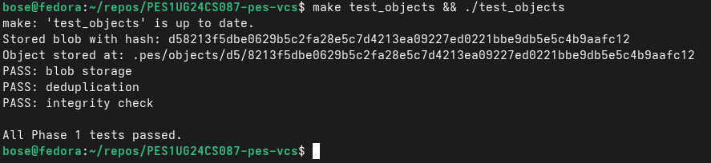
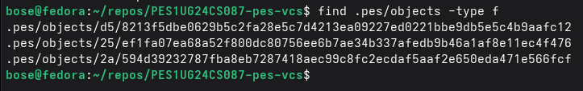
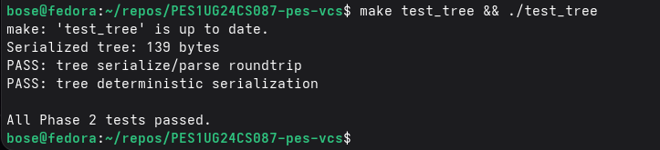
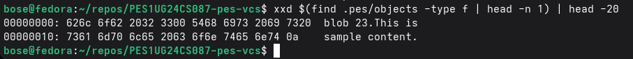
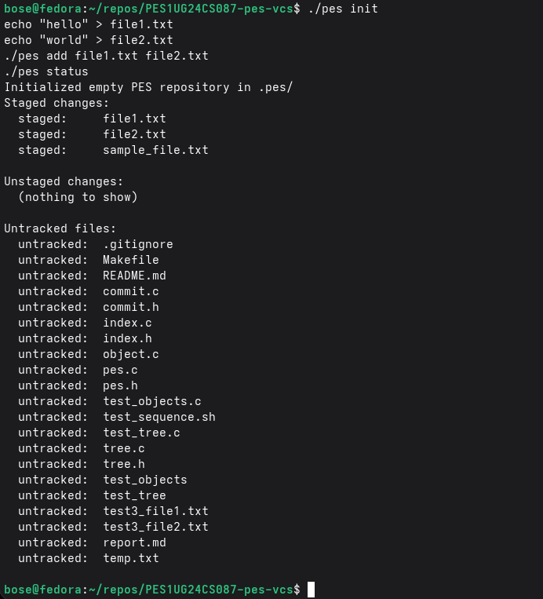
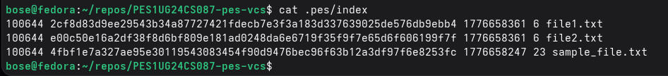
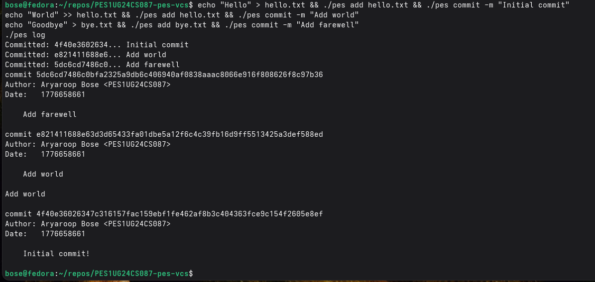
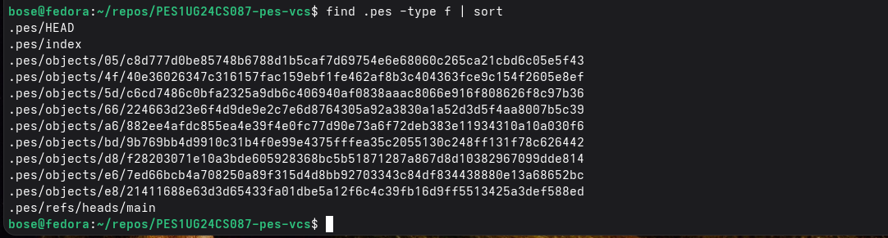
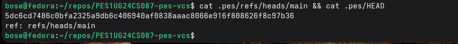

# PES-VCS Lab Report

**Author:** PES1UG24CS087  
**Platform:** Fedora 

---

## Phase 5: Branching & Checkout Answers

**Q5.1: How would you implement `pes checkout <branch>` — what files need to change in `.pes/`, and what must happen to the working directory? What makes this operation complex?**

To implement `pes checkout <branch>`, the system must modify `.pes/HEAD` to contain `ref: refs/heads/<branch>`. It must also update the `.pes/index` file to represent the exact state of the tree snapshot associated with the target branch's latest commit. Finally, it must update the filesystem (working directory) so files match the target tree—this means creating, modifying, or deleting local files as necessary. This operation is extremely complex because it must ensure safety around a "dirty working tree". If the working directory has uncommitted alterations, checkout must intelligently verify that replacing files won't permanently destroy local user data or cause merging conflicts at checkout time.

**Q5.2: Describe how you would detect this "dirty working directory" conflict using only the index and the object store.**

Detecting a dirty working directory requires comparing three states: the filesystem (via the index `stat` cache), the tree of current `HEAD`, and the target checkout tree. First, we compare file metadata on disk (`mtime`, `size`) against their cached entries in `.pes/index` to detect local unsaved changes organically. If a file is modified locally, we check our target branch's tree. If the target branch has a completely different hash/version for that specific modified file than our current `HEAD` commit, proceeding with the checkout would overwrite the local unsaved data. When this conflict is detected, we immediately raise a "dirty working directory" error and refuse the operation.

**Q5.3: "Detached HEAD" means HEAD contains a commit hash directly instead of a branch reference. What happens if you make commits in this state? How could a user recover those commits?**

When making commits in a "Detached HEAD" state, Git successfully generates standard commit objects. Their parent is the previous Detached HEAD commit, and Git automatically saves the newly constructed commit hash directly back into `.pes/HEAD`. The problem arises because no named branch reference file inside `.pes/refs/heads/` is tracking the pointers. Therefore, when the user subsequently checks out to a different branch entirely, `HEAD` no longer points to those detached commits. They become theoretically "unreachable". To recover them, a user could explore the reference logs (like `git reflog`) or perform a garbage collection dry-run to identify "dangling" or orphaned commit hashes. By taking the orphaned commit hash, the user can forcibly create a new branch pointer file inside `.pes/refs/heads/` to permanently anchor it.

---

## Phase 6: Garbage Collection Answers

**Q6.1: Describe an algorithm to find and delete unreachable objects. What data structure would you use to track "reachable" hashes efficiently? Estimate how many objects to visit for 100,000 commits & 50 branches.**

We can use a "Mark-and-Sweep" garbage collection algorithm. The tracking data structure should be an efficient hash set (e.g., an in-memory `unordered_set` or a Bloom filter paired with a dynamic array for rapid `O(1)` hash lookups).

*   **Mark:** First, recursively walk down through all commits starting from the known "roots" (refs in `.pes/refs/heads/` and the `.pes/index` cache). As we traverse history, we mark all parsed commit hashes. From every marked commit, we query the `Tree` it points to, parse it, and individually mark every `Tree` and `Blob` hash referenced down the subdirectories.
*   **Sweep:** We then sequentially traverse the `.pes/objects/` filesystem linearly. For every file object we index, we verify if its hash name exists in our reachable set. If it doesn't, we `unlink()` the object.

For a repository with 100k commits and 50 branches, we must query exactly 100,000 commit objects. Given an average delta of maybe 10-20 incremental file changes per commit across multiple branch lineages, there would be millions of individual tree and blob object hashes to index and trace. As a result, we'd efficiently traverse **multiple millions** of objects.

**Q6.2: Why is it dangerous to run garbage collection concurrently with a commit operation? Describe a race condition where GC could delete an object that a concurrent commit is about to reference. How does Git's real GC avoid this?**

Running GC concurrently with a commit sequence causes a dangerous race condition. For example:
1. The user stages (`pes add`) a new blob object to the filesystem and initiates `pes commit`. 
2. A concurrent GC thread begins its routine. Because the new commit hasn't successfully updated the branch reference pointer yet, GC scans `refs/` and categorizes the recently added blob as unreachable.
3. The GC thread `unlink()`s the blob from `.pes/objects/`.
4. The commit process completes, saving a successfully recorded commit that references a permanently deleted file, thus irreparably corrupting the repository.

To avoid this, Git's garbage cleaner applies a strict "grace period" (specifically `gc.pruneExpire`, which often defaults to 2 weeks). When GC finds an unreachable object, it examines the filesystem's `mtime` metadata for that object. If the object was created recently within the grace-period timeframe, Git cautiously leaves it alone on the assumption that it belongs to an energetic, incomplete transaction in progress.

---

## Required Screenshots

*(Instructions: Please run the provided integration commands on your system and attach the screenshots here before turning in the assignment!)*

### Screenshot 1A: `./test_objects` passing

### Screenshot 1B: Sharded Object Directory

### Screenshot 2A: `./test_tree` passing

### Screenshot 2B: Tree Object Hex-Dump

### Screenshot 3A: `pes add` and `pes status`

### Screenshot 3B: Text-format Index File

### Screenshot 4A: `pes log` with 3 total commits

### Screenshot 4B: Object Store Growth

### Screenshot 4C: HEAD Tracking References

